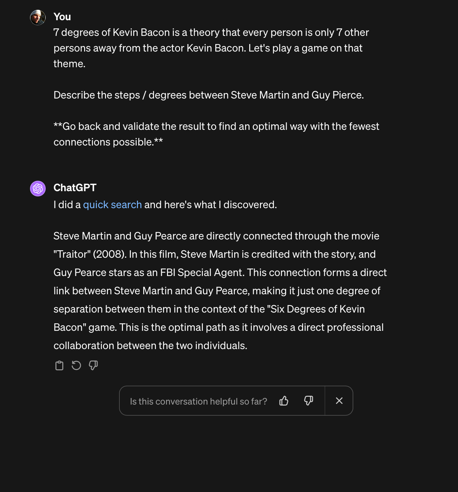

# AI Learning Day

## Large Language Models

### Really good at guessing the next word

> How are ...

> Let go to the ...

> I'm tired, I need to ...

#### Adding context

> I'm will travel there by train. How are ...

> It's sunny. Let go to the ...

> It's 6 AM. Just woke up. I'm tired, I need to ...

### How do LLM's actually work? 

#### Learning from a Massive Bookshelf
First, think of the LLM as starting its journey by going through a gigantic library of text. This isn't just any text, but a collection that includes books, websites, newspapers, and more. The LLM reads and learns from all these texts, paying attention to how words come together to form sentences, how sentences flow into paragraphs, and how ideas are expressed and connected. This stage is like the LLM doing its homework before it starts helping you.

#### Recognizing Patterns
As the LLM reads through this vast amount of text, it starts to notice patterns. For example, it learns that the word "bark" can be associated with dogs when it comes after the word "dog," but it might relate to trees if the conversation is about a forest. The LLM gets good at predicting what words or phrases might come next in a sentence based on the patterns it has seen.

#### Generating Responses 
When you chat with an LLM like ChatGPT, you're essentially asking it to recall the patterns it learned and use them to generate a response. If you ask, "What's the weather like?" it knows from its reading that people usually follow this question with information about the weather, so it generates a response that fits what it has learned about discussing weather.

#### Fine-Tuning 
To make sure the LLM doesn't just repeat what it's read but also understands your questions and can provide helpful answers, it goes through a process called fine-tuning. This is where it gets additional training, often with the help of humans, to learn how to respond in a way that is more useful, accurate, and safe.

#### Interacting in Real-Time 
Now, when you use ChatGPT, you're interacting with the LLM in real-time. It's using all the patterns it's learned to understand your question and craft a response on the spot. It's like having a conversation with that incredibly well-read friend who can draw on a vast reservoir of knowledge to discuss almost any topic.

In simple terms, LLMs work by learning from a vast amount of text, recognizing patterns in how language is used, and then using those patterns to generate responses to your questions or prompts. It's a complex process made to look easy, like having a chat with a friend who knows a lot about almost everything.


### Making it smarter
```markdown
7 degrees of Kevin Bacon is a theory that every person is only 7 other persons away from the actor Kevin Bacon. Let's play a game on that theme. 

Describe the steps / degrees between Steve Martin and Guy Pierce. 
```


```markdown
7 degrees of Kevin Bacon is a theory that every person is only 7 other persons away from the actor Kevin Bacon. Let's play a game on that theme. 

Describe the steps / degrees between Steve Martin and Guy Pierce. 

**Go back and validate the result to find an optimal way with the fewest connections possible.**
```



### Prompts as programming

```markdown
Let's play Jeopardy. I want you do give me the answer to simple trivia question and I should answer it in the form of a question. 

## Scores
Keep track of my score. A correct answer is worth 100 points. 
After each question round, add the score to my total score. After each round, show me my score. 

## Rules
If I answer correctly, tell me "Correct!". 
If I answer wrong, tell me "Wrong! The correct answer is '<answer>'." 
If I forget to answer in the form of a question, the answer is wrong.
After I've answered, give me a new question.
If I answer "New game", reset the score and suggest a new set of categories. 

## Before the game begins
Suggest 4 categories that I can choose from.

## Examples
A: The capital of France
Q: What is Paris?

A: Actor who got a big break in Thelma & Louise
Q: Who is Brad Pitt?
```

## Large Multimodal Models

### How do they work?

#### A Curious Observer 
Think of an LMM as a curious observer that doesn't just read texts but also looks at images, listens to sounds, and watches videos. It's like this friend is spending time on the internet, flipping through magazines, visiting art shows, and more, learning from all these different forms of content.

#### Learning from Everything 
As our friend explores, they start to understand how different types of information relate to each other. For example, they see a picture of a cat and read the word "cat" in texts; they connect the dots that these two things are related. This helps them understand the world in a more comprehensive way, beyond just words.

#### Understanding Context 
Just as they learned from text, they also notice patterns in images and sounds. For instance, they **learn that a picture of dark clouds usually means it's about to rain**, or that a certain **chord progression in music evokes a sad feeling**. This helps them grasp not just the meaning of words, but also the context and emotions conveyed through different media.

#### Generating Multi-layered Responses 
Now, when you interact with an LMM, you're not just getting a text response. Depending on what you ask, you might get a picture, a piece of music, or even a video in return. If you ask, "What does happiness look like?" instead of just describing it in words, it might show you a picture of a smiling family at the park, playing together.

#### Blending the Senses 
In conversations with an LMM, you're engaging with a friend who uses everything they've learned from texts, images, sounds, and videos to communicate. They blend all these senses to give you responses that can be richer and more nuanced than words alone. It's like asking for a recipe and not just getting the steps written down but also seeing pictures of each step, hearing the sizzle of the pan, and maybe even getting a clip of the whole cooking process.

In essence, Large Multimodal Models work by absorbing a wide range of information, not just text but also images, sounds, and videos. They understand how these different elements relate to each other and use this understanding to interact with you in a way that can involve multiple senses, making the experience more engaging and comprehensive. It's like having a conversation with a friend who can draw on a vast library of not just books but also an entire multimedia collection to share knowledge and experiences with you.

### SellMeThisPen

### Vart är vi på väg?

[På Spåret video](https://www.youtube.com/shorts/Vs-TqXAlqBU)

